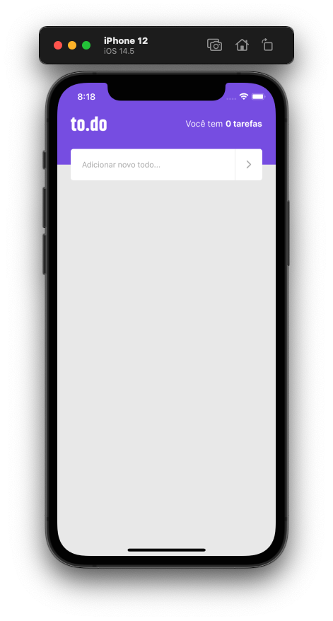
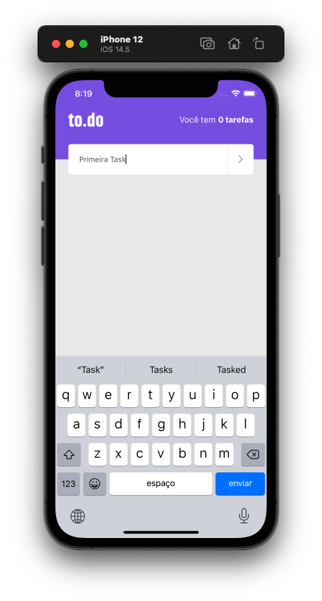
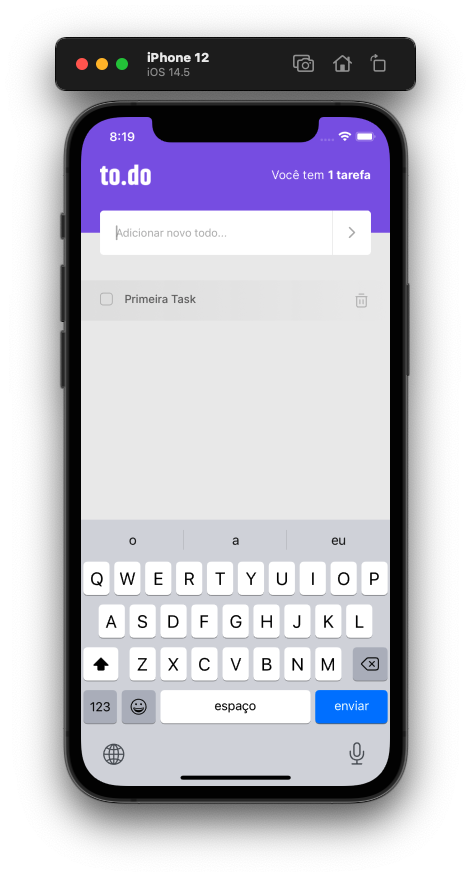
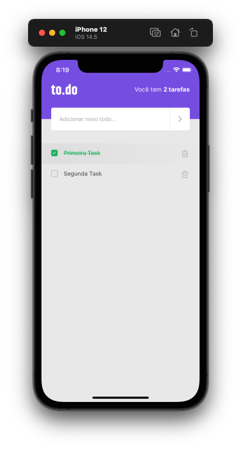
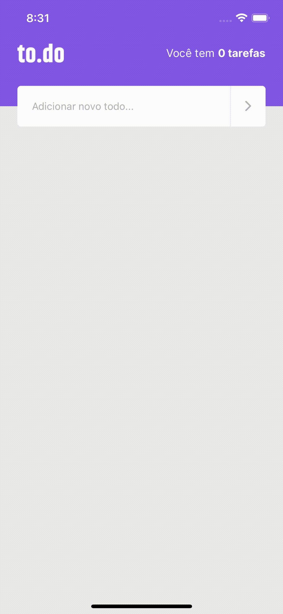

# To do

O To do é uma aplicação simples desenvolvida como resultado de estudos da trilha Ignite da Rocket Seat. O objetivo do App é auxiliar você com suas tarefas diarias. Nesse App o usuário adiciona a nova tarefa, podendo marca-la como concluída e/ou removê-la da lista de tarefas. Essa aplicação utiliza não utiliza banco de dados, por isso os dados cadastrados não ficarão salvos após fechar o App.

https://www.rocketseat.com.br/ignite

## Features

• Cadastrar uma tarefa  
• Marcar a tarefa como concluída  
• Deletar a tarefa  

## View screens

      
      

      
      

## App

